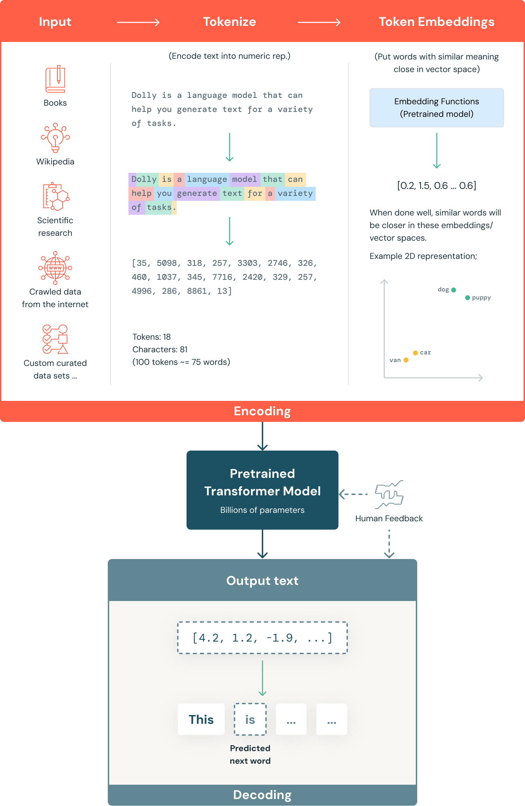

# What are large language models (LLMs)?

Language models are a type of generative AI (GenAI) that use natural language processing (NLP) to understand and generate human language. Large language models (LLMs) are the most powerful of these. LLMs are trained from massive datasets using advanced machine learning (ML) algorithms to learn the patterns and structures of human language and generate text responses to written prompts. Examples of LLMs include BERT, Claude, Gemini, Llama and the Generative Pretrained Transformer (GPT) family of LLMs.

LLMs have significantly surpassed their predecessors in performance and ability in a variety of language-related tasks. Their ability to generate complex, nuanced content and automate tasks for human-like results is driving advancements in various fields. LLMs are being widely integrated into the business world for impact across a variety of environments and business uses, including automating support, surfacing insights and generating personalized content.

### **Core LLM AI and language capabilities include:**

- **Natural language understanding:** LLMs can understand the nuances of human language, including context, semantics and intent.

- **Multimodal content generation:** LLMs can produce human-like text for various purposes, from coding to creative writing, as well as images, speech and more.

- **Question answering:** LLMs can intelligently answer open-ended questions.  

- **Scalability:** LLMs can leverage graphics processing unit (GPU) capabilities to efficiently take on large-scale language tasks and adapt to growing business needs.

### How do LLMs work?

Most LLMs are built using a transformer architecture. They work by breaking input text into tokens (subword units), embedding those tokens into numerical vectors and using attention mechanisms to understand relationships across the input. They then predict the next token in a sequence to generate coherent outputs.

### What does it mean to pretrain LLMs?

Pretraining an LLM model refers to the process of training it on a large body of data, such as text or code, without using any prior knowledge or weights from an existing model. The output of full pretraining is a base model that can be directly used or further fine-tuned for downstream tasks.

Pretraining ensures that the foundational knowledge of the model is tailored to your specific domain. The result is a custom model that is differentiated by your organization’s unique data. However, pretraining is typically the largest and most expensive type of training and is not typical for most organizations.

### What does it mean to fine-tune LLMs?

**Fine-tuning** is the process of adapting a pretrained LLM on a comparatively smaller dataset that is specific to an individual domain or task. During the fine-tuning process, the LLM continues training for a short time, possibly by adjusting a relatively smaller number of weights compared to the entire model.

The two most common forms of fine-tuning are:

**Supervised instruction fine-tuning:** This approach involves continued training of a pretrained LLM on a dataset of input-output training examples, typically conducted with thousands of training examples.

**Continued pretraining:** This fine-tuning method does not rely on input and output examples but instead uses domain-specific unstructured text to continue the same pretraining process (such as next token prediction and masked language modeling).

Fine-tuning is important because it allows an organization to take a foundation LLM and train it with its own data for greater accuracy and customization for the company’s domain and workloads. This also gives the organization control to govern the data used for training so you can make sure you’re using AI responsibly.

### Neural networks and transformer architecture

LLMs are built on deep learning, a form of AI in which large amounts of data are fed into a program to train it, based on probability. With exposure to massive datasets, LLMs can train themselves to recognize language patterns and relationships without explicit programming, with self-learning mechanisms to continuously improve accuracy.

The foundation of LLMs is artificial neural networks, inspired by the structure of the human brain. These networks consist of interconnected nodes arranged in layers, including an input layer, an output layer and one or more layers in between. Each node processes and transmits information to the next layer based on learned patterns.

LLMs use a type of neural network called a transformer model. These groundbreaking models can look at an entire sentence all at once, in contrast to older models that process words sequentially. This makes them able to understand language faster and more efficiently. Transformer models use a mathematical technique called self-attention, which assigns varying importance to different words in a sentence, enabling the model to grasp nuances in meaning and understand context. Positional encoding helps the model understand the importance of word order within a sentence, which is essential to comprehending language. The transformer model enables LLMs to process vast amounts of data, learn contextually relevant information and generate coherent content.

### A simplified version of the LLM training process

### What are the use cases for LLMs?
LLMs can drive business impact across use cases and different industries. Example use cases include:

**Chatbots and virtual assistants:** LLMs are used to power chatbots to give customers and employees the ability to have open-ended conversations to help with customer support, website lead follow-up and personal assistant services.

**Content creation:** LLMs can generate different types of content, such as articles, blog posts and social media updates.

**Code generation and debugging:** LLMs can generate useful code snippets, identify and fix errors in code and complete programs based on input instructions.

**Sentiment analysis:** LLMs can automatically understand the sentiment of a piece of text to gauge customer satisfaction.

**Text classification and clustering:** LLMs can organize, categorize and sort large volumes of data to identify common themes and trends to support informed decision-making.

**Language translation:** LLMs can translate documents and web pages into different languages to reach different markets.

**Summarization and paraphrasing:** LLMs can summarize papers, articles, customer calls or meetings and concisely capture the most important points.

**Security:** LLMs can be used in cybersecurity to identify threat patterns and automate responses.

# Author : Mathi Yuvarajan T.K